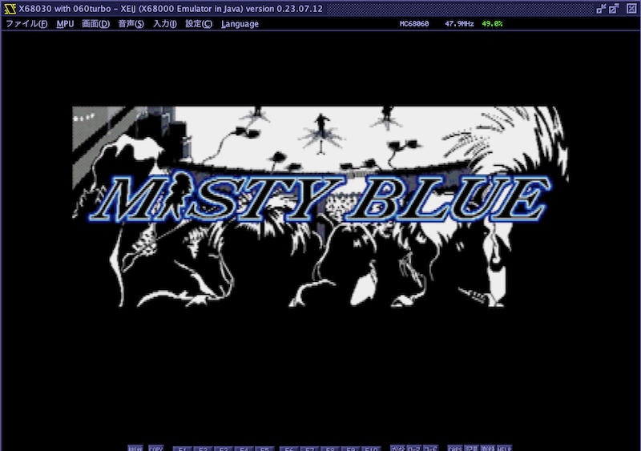
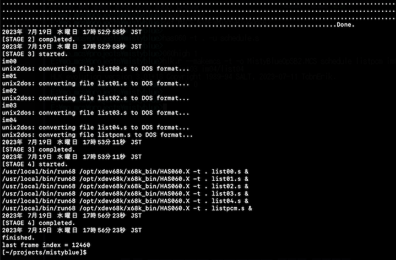
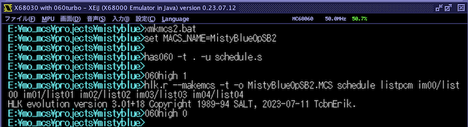
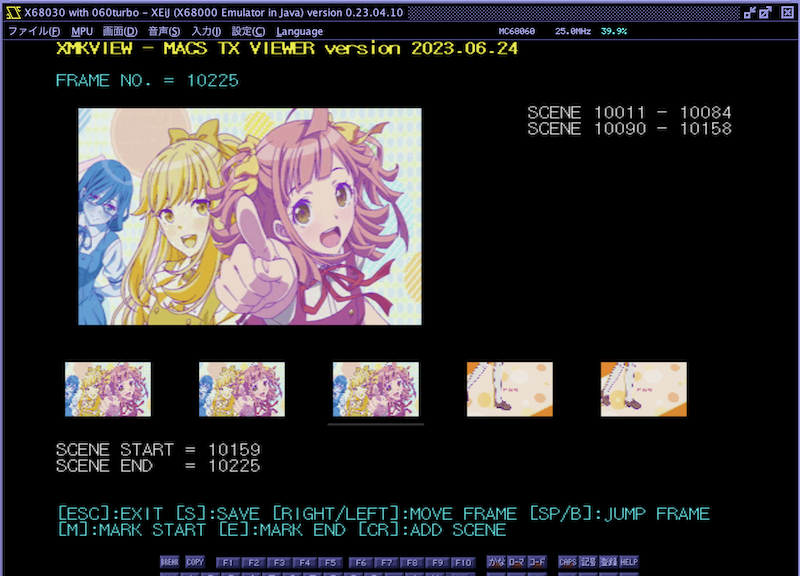

# xmkmcs

クロスプラットフォーム対応 MACS アニメーションデータ作成システム

---

## About This

macOS, Linux, WSL2(Windows) など、UNIX-Like OS上でMACSデータを作成するためのテンプレートbashスクリプト+支援ツール群のセットです。
ゼロからMACSをオーサリングするためのものではなく、素材となる何らかの動画ファイルをMACSデータに変換することを目的としています。

- 入力として任意の動画ファイル(avi,mp4等)に対応
- 解像度・fps変換により出力データサイズをコントロール可能
- 時間のかかるTx/Tpオブジェクトアセンブル処理をマルチコアで並列実行
-	3通りのパレット最適化対応(完全可変、完全固定、一部固定)
-	3通りの画像圧縮対応(無圧縮、LZE圧縮、無圧縮:LZE=50:50)
- PCM/ADPCMデータのボリューム調整可能、レベルチェック機能付

注意: 最後のスケジュールアセンブルおよびリンク部分のみ68エミュレータ上での実行が必要です。(推奨：XEiJ 060turbo ハイメモリ拡張モード)

手元の環境(M1 MacBook)だと、約4分ほどで90秒のMACSデータの生成が可能です。

---

## 動作環境

#### ホストOS側

- macOS
- Linux

WSL2でも動作するとは思いますが、環境を持っていないため未確認です。

クロスコンパイル環境xdev68kを入れる必要はありませんが、xdev68kが入っていると楽にセットアップできます。

#### 68エミュレータ側

- XEiJ 0.23.07.12以上 ハイメモリ 768MB 060turbo.sys 0.58以上 拡張モード(`-ss` `-dv` `-xm`)

最終的にMACSデータを出力するにはHLKによるリンク処理が必要であり、この際に出力MACSデータサイズの約2倍のメモリを必要とします。
ハイメモリ768MBの環境であれば約384MBまでのMACSデータを生成することが可能です。

---

## Install (ホストOS側)

#### pcm2adpcm の導入

        pip install git+https://github.com/tantanGH/pcm2adpcm.git

コマンドラインから使えることを確認。

        pcm2adpcm -h

#### gif2tx の導入

        pip install git+https://github.com/tantanGH/gif2tx.git

コマンドラインから使えることを確認。

        gif2tx -h

#### dos2unix の導入

macOS:

        brew install dos2unix

Linux/WSL2:

        sudo apt-get install dos2unix

コマンドラインで `unix2dos` が使えることを確認。

        unix2dos -h

#### lha の導入

macOS:

        brew install lha

Linux/WSL2:

        sudo apt-get install lhasa

コマンドラインで `lha` が使えることを確認。

        lha

#### lze の導入

* [lze](http://gorry.haun.org/pw/?lze)

作業ディレクトリにて、

        wget --output-document=lze_20080228a.lzh 'http://gorry.haun.org/cgitest/download.pl?subject=CGI-DOWNLOAD%20lze_20080228a.lzh&info=readcount&file=lze.html&downfile=lze_20080228a.lzh'

        lha x lze_20080228a.lzh

ソースファイル末尾にある^Zを削除する。

        mv lze.c lze.c.orig

        sed -e '$d' lze.c.orig > lze.c

本リポジトリの`lze/Makefile.gcc`を使ってmakeする。

        make -f Makefile.gcc

パスの通った場所に出来上がった`lze`をコピーするかシンボリックリンクを張っておく。

コマンドラインで `lze` が使えることを確認。

        lze

#### ffmpeg の導入

* [ffmpeg](https://ffmpeg.org/)

macOS:

        brew install ffmpeg

Linux/WSL2:

        sudo apt-get install ffmpeg

他のツールに比べると規模が大きいので注意。ラズパイOSの場合バージョンによってはエラーになるかも。

コマンドラインで `ffmpeg` が使えることを確認。

        ffmpeg -h

#### run68mac の導入

* [run68mac](https://github.com/GOROman/run68mac) 

オリジナルのrun68.exeと異なり、Windows専用ではなく、macsOS, Linux, WSL2などでも動作するるようにしたもの。
リンク先の手順に従い導入する。xdev68k クロスコンパイル環境が既に導入されていれば確認のみで良い。

コマンドラインで `run68` が使えることを確認。

        run68

#### HAS060.X の導入

* [HAS060](http://retropc.net/x68000/software/develop/as/has060/) 

HAS060.X をアクセス可能な位置に置いておく。xdev68k クロスコンパイル環境が既に導入されていれば確認のみで良い。

例：
        /opt/xdev68k/x68k_bin/HAS060.X

run68で HAS060.X が使えることを確認。

        $ run68 /opt/xdev68k/x68k_bin/HAS060.X
        X68k High-speed Assembler v3.09+91 (C) 1990-1994/1996-2023 Y.Nakamura/M.Kamada
        使用法: has060 [スイッチ] ファイル名
                -1              絶対ロング→PC間接(-b1と-eを伴う)
                -8              シンボルの識別長を8バイトにする
        ...

---

## Install (68エミュレータ側)

#### XEiJ 0.23.07.12テスト版以上の導入

* [XEiJテスト版](https://stdkmd.net/xeijtest/)

- ハイメモリ 768MB 設定
- 機種選択 060turbo 50MHz
- 同梱されている 060turbo.sys 0.58 を拡張モード(`-ss` `-dv` `-xm`)で組み込む
- HFSでホストOS側のフォルダが見えるようにしておく

#### HAS060.X 3.09+91以上の導入

* [HAS060](http://retropc.net/x68000/software/develop/as/has060/)

#### HLK evolution 3.01+18以上の導入

* [HLK evolution](https://github.com/kg68k/hlk-ev)

3.01+18で対応したMACSファイルダイレクト生成オプションを前提としているので、必ずこのバージョン以上を導入する。

#### 060highの導入

* [060high](http://retropc.net/x68000/software/hardware/060turbo/060high/)

HLK evolutionがハイメモリを使うために必要

#### MACSスケジューラ用インクルードファイルの導入

最新のMACSDRV(改造版)に含まれる `macs_sch.h` を環境変数`include`(小文字)で指定したディレクトリにコピーしておく。
環境変数`HAS`で`-i<ディレクトリ名>`と指定した場所でも良い。

---

## 使い方

1. 素材となる動画ファイルを用意する

2. ホストOS上に作業フォルダを作成する

このフォルダはXEiJから読み書きアクセスできること。

3. 作業フォルダに以下の3つのファイルをコピーする

- xmkmcs1.sh
- xmkmcs2.bat
- schedule.s

4. xmkmcs1.sh の編集

スクリプト終盤にある設定パラメータを調整していく。

        # HAS060.X path
        has060=/opt/xdev68k/x68k_bin/HAS060.X 

ホストOS上に置いた HAS060.X のフルパスを設定する。

        # source movie file
        source_file="./MadokaMagicaOp.m4v"

入力となる動画データファイルのパス名を指定する。

        # source movie cut start/to timestamps
        #   note: ffmpeg cuts movie at each key frame, so you should set 'rough' time range for these parameters.
        source_cut_ss="-ss 00:02:57.500"
        source_cut_to="-to 00:04:29.000"

元動画をどの位置から切り出すかを大雑把に指定する。切り出し開始時間および切り出し終了時間をmsecまでの単位で設定。
実際にはキーフレーム単位での切り出しとなるので厳密にこのタイミングで切り出されるわけではない。

        # source movie cut start offset and length
        #   note: this is applied AFTER the source movie is cut at key frames.
        source_cut_offset="-ss 00:00:00.800"
        source_cut_length="-t  00:01:29.500"

大雑把に切り出された後に厳密に切り出しを開始するオフセット位置をmsec単位で指定する。また、切り出しの長さを同様に指定する。
元動画の一部を切り出す場合は何度か微調整が必要かも。

        # macs fps
        #fps=13.865     # SET_FPS15_X68
        #fps=15.0       # SET_FPS15
        #fps=18.486     # SET_FPS20_X68
        #fps=23.976     # SET_FPS24_NTSC
        fps=24.0       # SET_FPS24
        #fps=27.729     # SET_FPS30_X68
        #fps=29.97      # SET_FPS30_NTSC
        #fps=30.0       # SET_FPS30
        #fps=55.458     # SET_FPS60_X68

生成するMACSデータのfpsを指定する。いずれかをコメントアウトする。

        # use variable palette or fixed palette
        #variable_palette=0
        variable_palette=1

可変パレット(フレーム1枚ごとに256色パレットを新たに定義しなおす)の場合は1、固定パレット(切り出した動画全体を通して256色パレットを固定する)場合は0を指定する。基本的には1を選択し、画面全体があまり動かないもの、ゲーム動画素材などは0が良い場合が多い。また後述する機能を使って特定フレーム間のみ固定とすることも可能。この場合は1を選択しておく。

        # macs screen size (384x256 or 256x256)
        #screen_width=384
        screen_width=256
        screen_height=256

画面モードを選択する。現時点でサポートされているのは384x256または256x256のみ。screen_widthはどちらかをコメントアウトする。

        # macs view size (must be within the screen size)
        #view_width=384
        view_width=256
        #view_height=256
        view_height=216

実際に表示を行うサイズを指定する。横は一つ前の画面モードに合わせる。縦は4:3ソースなら256、16:9ソースであれば216を基本とするが、必要に応じて調整する。216だとやや縦長になる。また、数値が少ない方が描画ラインを減らすことができるのでフレーム落ちが減る。208,200,192なども選択肢に入れる。

        # crop offset (optional, in case you want to crop certain part of the source movie frame)
        #crop_x="-cx 0"
        #crop_y="-cy 0"
        crop_x=
        crop_y=

ソース動画のフレームの一部分を切り出したい時にオフセット位置の指定に使うことができるが、とりあえず設定不要。

        # dither options (0-5, 0:more grains 5:more bands)
        bayer_scale=4
        #bayer_scale=5

減色時のディザのかけ具合を決める。数値が小さいほどグレインが目立つようになる。推奨値は4だが、実際の絵を見て調整していく。
5にするとほぼディザなしとなる。バンディングが目立つようになるが、ゲーム素材などはこちらの方が良い場合が多い。

        # output PCM frequency (48000/44100/22050)
        #pcm_freq=48000
        #pcm_freq=44100
        pcm_freq=22050

出力する16bitPCMのサンプリング周波数を48kHz, 44.1kHz, 22.05kHzの中から選択する。

        # output PCM volume ratio
        pcm_volume=1.0

出力するPCMのボリュームをソースに対する比率で指定する。あまり大きくするとレベルオーバーになるので注意。
ADPCMデータ生成時に平均レベル・ピークレベルの簡易チェックを行い、推奨レンジに入っていない場合はエラーとなり処理が中断する。

        # output ADPCM frequency
        adpcm_freq=15625

出力するADPCMの周波数を指定する。変更の必要なし。

        # LZE compression (0:no 1:yes 2:raw:lze=50:50)
        #lze_compression=0
        #lze_compression=1
        lze_compression=2

画像圧縮方式を3通りから選ぶ。0だと無圧縮、1だと全フレームLZE圧縮、2だと無圧縮とLZE圧縮を交互に使う。

        # temporary gif file name
        gif_file="_wip.gif"

        # temporary 16bit pcm file name
        pcm_file="_wip_pcm.dat"

        # temporary 16bit pcm file name 2 (for adpcm conversion)
        pcm_file2="_wip_pcm2.dat"

        # temporary adpcm file name
        adpcm_file="_wip_adpcm.dat"

特に変更の必要なし。

5. xmkmcs1.sh の実行

すべてのパラメータの設定が終わったらxmkmcs1.shを実行する。

        ./xmkmcs1.sh

6. schedule.s の編集

schedule.s を編集する。ホストOS側、68エミュレータ側からのどちらでも良いが、SJIS,CRLFで行うこと。

        .include macs_sch.h

        SET_OFFSET

変更不要。

        ;USE_DUALPCM 'S48'
        ;USE_DUALPCM 'S44'
        USE_DUALPCM 'S22'		

16bitPCMの出力周波数を指定する。xmkmcs1.sh の設定と合わせること。

        TITLE   'MACS sample'
        COMMENT '256x216 256colors variable palette 24.0fps raw:lze=50:50'

タイトルとコメントを設定する。

        ;SCREEN_ON_G384
        SCREEN_ON_G256

画面モードの横幅を設定する。xmkmcs1.sh の設定と合わせること。

        ;SET_FPS15_X68
        ;SET_FPS15
        ;SET_FPS20_X68
        ;SET_FPS24_NTSC
        SET_FPS24
        ;SET_FPS30_X68
        ;SET_FPS30_NTSC
        ;SET_FPS30
        ;SET_FPS60_X68

fpsを設定する。xmkmcs1.sh の設定と合わせること。

        ;SET_VIEWAREA_Y 256
        SET_VIEWAREA_Y 216

有効表示縦ライン数を指定する。xmkmcs1.sh の設定と合わせること。

        DRAW_DATA_RP 10000

        ;PCM_PLAY_S48 pcmdat,pcmend-pcmdat
        ;PCM_PLAY_S44 pcmdat,pcmend-pcmdat
        PCM_PLAY_S22 pcmdat,pcmend-pcmdat
        PCM_PLAY_SUBADPCM adpcmdat,adpcmend-adpcmdat

16bitPCM再生周波数に応じて設定する。

        ; set last frame index at the 2nd argument
        DRAW_DATA 10001,12345

        WAIT 60
        PCM_STOP

        EXIT

DRAW_DATA の第2引数は、xmkmcs1.sh の最後に出力された最終フレームNo.を設定する。

7. xmkmcs2.bat の編集

xmkmcs2.bat を編集する。ホストOS側、68エミュレータ側からのどちらでも良いが、SJIS,CRLFで行うこと。

        set MACS_NAME=sample1

出力するMCSファイルの主ファイル名を設定する。

        has060 -l -t . -u schedule.s

変更の必要なし。

        060high 1
        hlk.r --makemcs -t -o %MACS_NAME%.MCS schedule listpcm im00/list00 im01/list01 im02/list02 im03/list03 im04/list04
        060high 0

xmkmcs1.shの出力結果を見て、hlk.r の引数の imXX/listXX を必要に応じて追加(削除)する。

8. xmkmcs2.bat の実行

XEiJ 060turbo ハイメモリ拡張モードで xmkmcs2.bat を実行する。

以上。

---

## 一部固定パレットの指定方法

完全可変パレットにした時画面のチラつきが気になる場合は、シーン単位でパレットを固定することが可能。
この際に固定開始フレーム番号と固定終了フレーム番号を xmkmcs1.sh の中で以下のようにstage2とstage3の間で指定する。

        # STAGE2 gif2tx
        stage2

        # STAGE2a (optional for fixed palette)
        fix_palette  808 1048
        fix_palette 1784 1954

        # STAGE3 lze
        stage3

フレーム番号を画面サムネイルを見ながら指定していくには、一度 xmkmcs1.sh を実行した後に、付属の xmkview.x を68エミュレータ上で作業ディレクトリで実行すると比較的簡単に可能。

---

## 変更履歴

- version 2023.07.19
  - ドキュメント更新

- version 2023.07.12
  - XEiJ 0.23.07.11 を前提としたことで 192MB超の MACSデータが作成可能となった
  - HLK Evo 3.01+18 を前提としたことで makemcs.x が不要になった
  - 一部固定パレットのフレーム番号切り出しのためのツール(xmkview.x)を同梱

- version 2023.06.21
  - 100%raw, 100%lze, raw:lze=50:50の選択ができるようにした
  - 完全固定パレット、完全可変パレット、一部固定パレットの選択ができるようにした

- version 2023.06.18
  - 初版